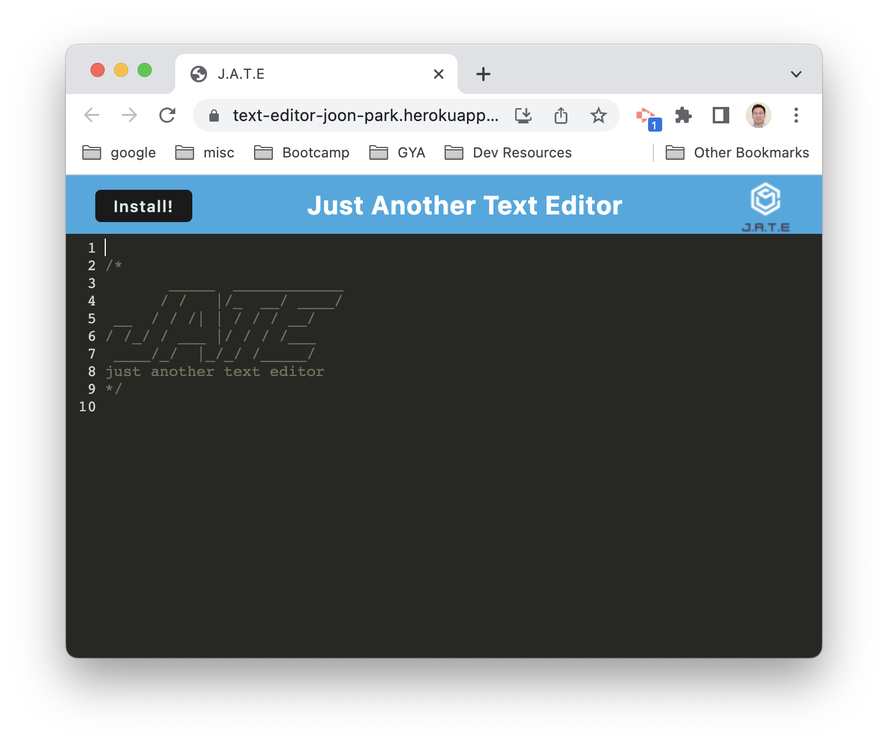
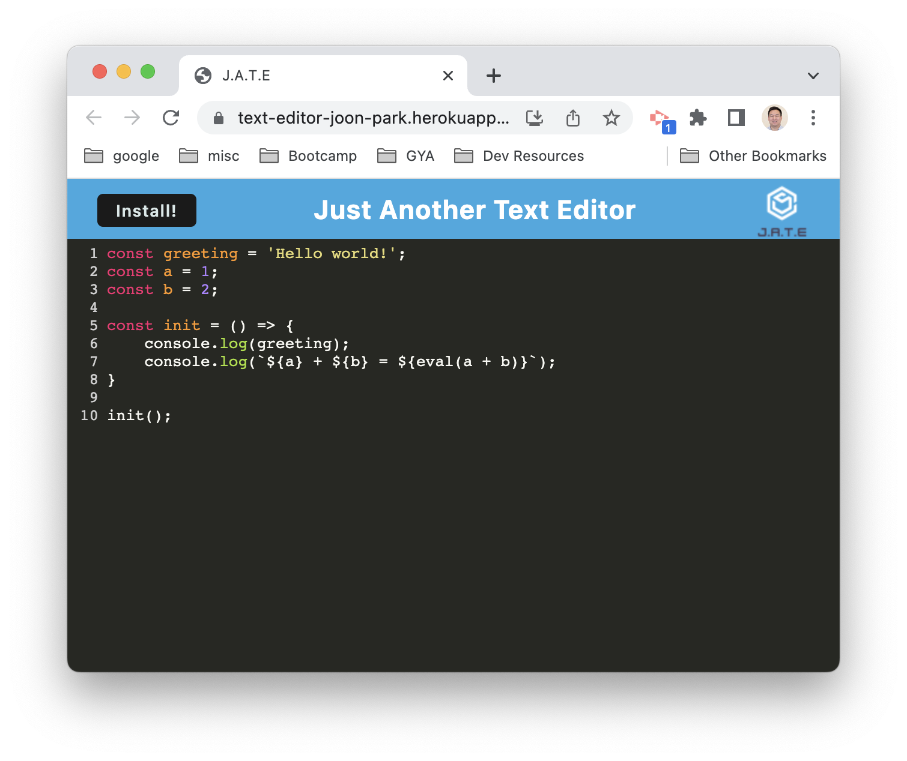
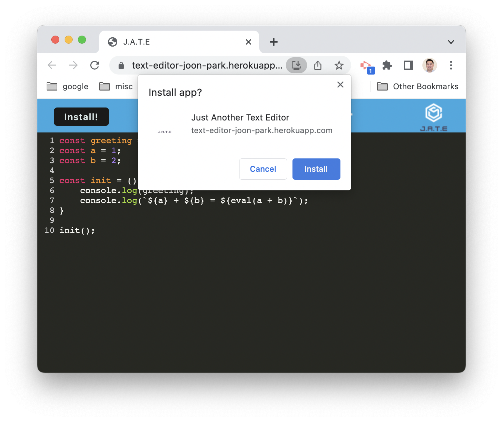
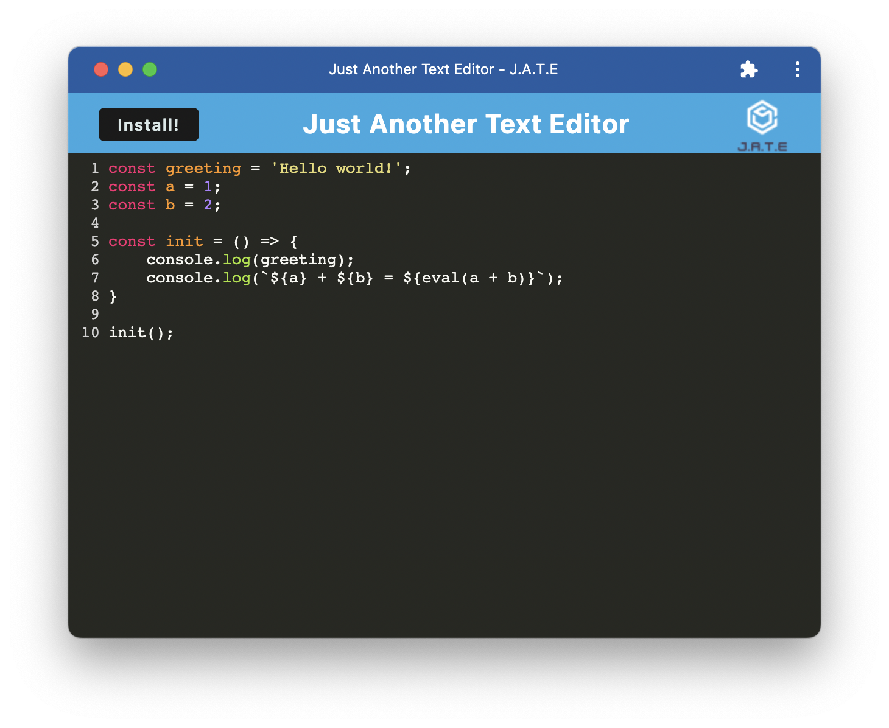
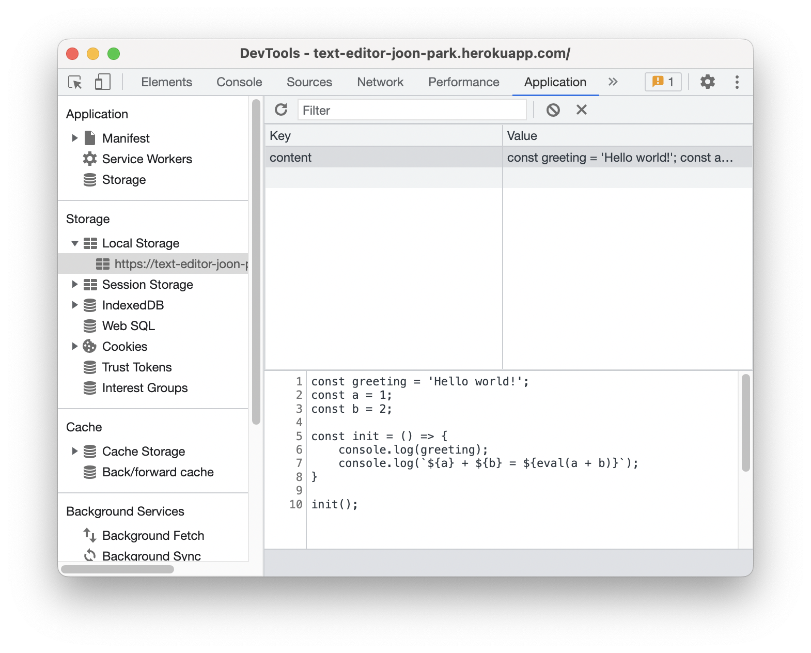
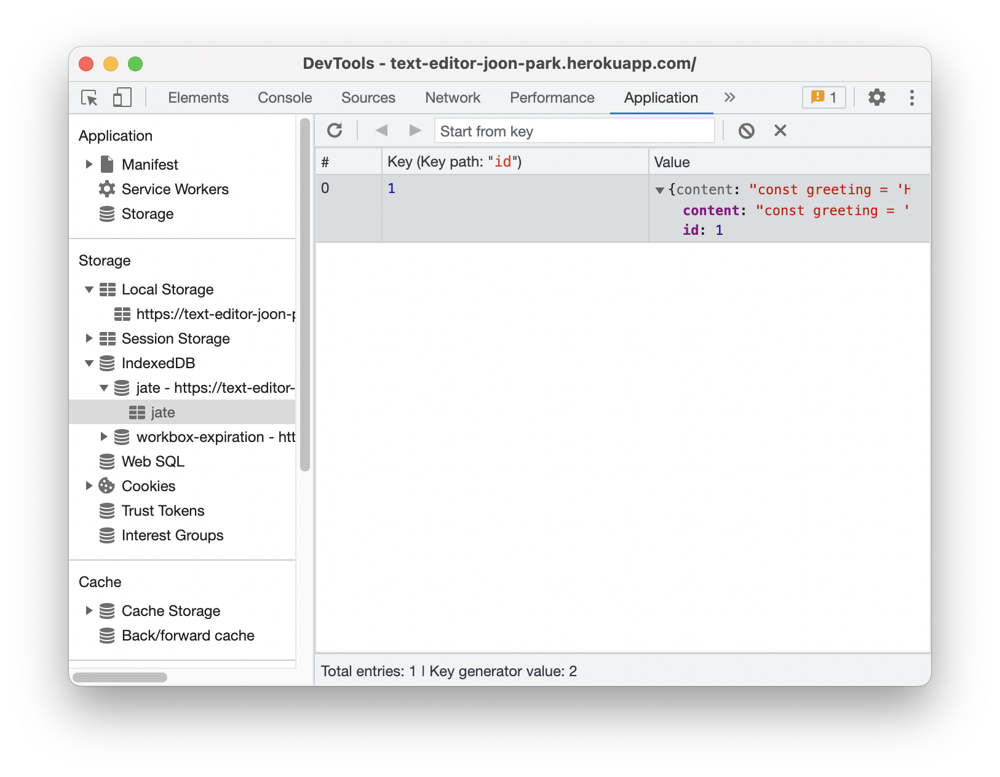

# Text Editor

## Description

A Progressive Web Application that allows the user to edit texts. The app saves any text entered into multiple different locations to ensure that the app works offline as well as online.

## Usage

The application can be accessed at:

[J.A.T.E.](https://text-editor-joon-park.herokuapp.com/)

Click anywhere on the editor and start typing.

Click the "Install" button on the top left corner to install this app as a Chrome Web App.

Data that is entered into the app is saved in LocalStorage as well as IndexedDB.

## GitHub Repo

The GitHub repo for this project can be accessed at:

[GitHub](https://github.com/jsp220/Text-Editor)

## License

Licensed under the MIT license.